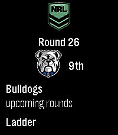
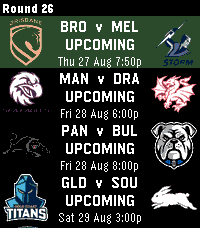
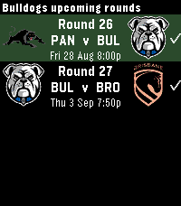
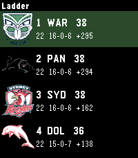

# NRL Fan

A Pebble watch app for NRL fans. Version 1.0.2 targets every current Pebble SDK
platform: original Pebble through Pebble Time 2.

Pick your NRL club, NRLW club and Origin side in the phone settings. The watch then shows:

- **My Team** — upcoming remaining games (Select a row to pin it to Timeline)
- **Live** — current-round scores (auto-refresh every 60s; Select a game for a fullscreen card)
- **Draw** — every round this season (opens on the current round; Select for that round’s games)
- **Upcoming** — remaining games for your side, with Timeline pins
- **Results** — this year’s completed scores
- **Ladder** — P, W, L, D, PD, Pts (Origin shows the series score instead)

Switch competition on the watch: NRL, NRLW, Origin, Origin W.

## Screenshots

More captures (results, competition switcher, extra layouts) are in [`screenshots/`](screenshots/).

Rebble store listing icons are in [`store/`](store/) (`icon-80.png`, `icon-144.png`). They are not packed into the `.pbw`.

## Compatibility

SDK 4.33 platforms (this is what the `.pbw` actually contains):

| Platform | Watches | Display | Status |
| --- | --- | --- | --- |
| **aplite** | Pebble, Pebble Steel | 144×168 B&W rect | Supported. Firmware **3.x** required. Tight 24 KB RAM. |
| **basalt** | Pebble Time, Time Steel | 144×168 colour rect | Supported |
| **chalk** | Pebble Time Round 14mm / 20mm | 180×180 round | Supported |
| **diorite** | Pebble 2, Pebble 2 HR | 144×168 B&W rect | Supported |
| **emery** | 2016 Time 2 spec (emulator only) | 200×228 colour rect | Builds; that watch never shipped |
| **flint** | Pebble 2 Duo | 144×168 B&W rect | Supported |
| **gabbro** | Pebble Time 2 | **260×260 round** colour | Supported (large round layouts) |

**Not compatible:** original Pebble / Steel still on firmware 2.x (SDK 3 apps will not install). There is no separate “Round 2” target — Time 2 is the large round platform (`gabbro`).

Timeline pins need the Rebble/Core Pebble phone app. Local pins use the football system icon.

## Data

Scores come from public NRL.com draw and ladder pages. There is no official API, so a site change can break parsing. Nothing is scraped in the background.
